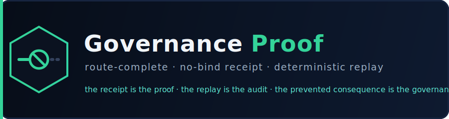
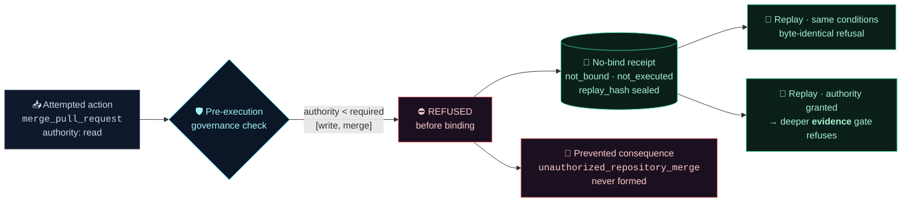
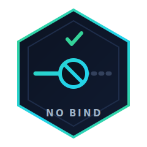

  

  
  
  
  

<h3 align="center">An invalid action stopped <em>before it binds</em> — with a no-bind receipt and a deterministic replay trail.</h3>

<strong>The receipt is the proof. The replay is the audit. The prevented consequence is the governance.</strong>

---

## The route, end to end

## What each artifact proves

| The standard | Artifact | What it shows |
|---|---|---|
| 📥 attempted action recorded | [`input.request.json`](input.request.json) | the request, declared vs required authority |
| 🛡️ check **before** execution | [`route.trace.json`](route.trace.json) | `evaluated_before_execution: true` |
| ⚠️ explicit failure condition | [`refusal.receipt.json`](refusal.receipt.json) | `failure_class: authority_failure` |
| ⛔ refused **before binding** | [`refusal.receipt.json`](refusal.receipt.json) | `binding_state: not_bound`, `execution_state: not_executed` |
| 🧾 **no-bind receipt** | [`refusal.receipt.json`](refusal.receipt.json) | `receipt_type: no_bind_refusal`, sha256 `replay_hash` |
| 🔁 replays — same conditions | [`replay.same.log`](replay.same.log) | `Receipt hash match: true` |
| 🔁 replays — changed condition | [`replay.changed-condition.log`](replay.changed-condition.log) | authority granted → the **evidence** gate refuses |
| 🚫 consequence prevented | [`prevented-consequence.md`](prevented-consequence.md) | `unauthorized_repository_merge` never formed |
| 🔏 receipt is sealed | [`integrity.md`](integrity.md) | tamper one byte → verifier reports `tampered` |

## The case

An actor (`agent.demo`) requested `merge_pull_request` holding only `read` authority; the route
required `write` + `merge`. The governance check ran **before execution** and refused — nothing
bound, nothing executed. Replayed under identical conditions: byte-identical refusal. Replayed
with the missing authority **granted**: that gate clears and the **next** gate (evidence) refuses —
proving the refusal is *conditional and governed*, **not a hardcoded "no"**.

The `replay_hash` is a sha256 seal over the canonical decision inputs — identical inputs yield a
byte-identical receipt, which is why [`replay.same.log`](replay.same.log) reports
`Receipt hash match: true`. See [`verification.md`](verification.md) for how to read the packet
and the honest scope of the claim.

---

   
  A warning is not proof. A receipt is. — <a href="verification.md">verification.md</a>

